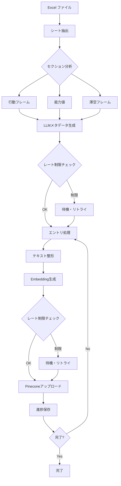
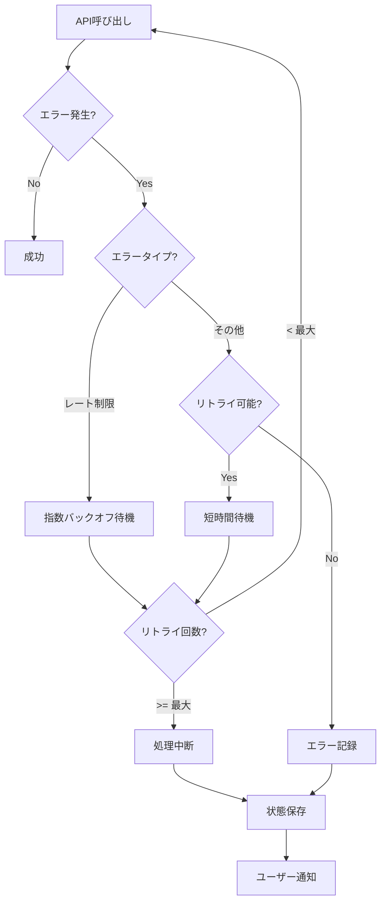

# Excel取り込み実装仕様書

## 📐 アーキテクチャ概要

### システムフロー



### エラー処理フロー



---

## 🔧 実装詳細

### 1. レート制限対策モジュール

#### 1.1 設定クラス

```python
from dataclasses import dataclass
from typing import Optional

@dataclass
class RateLimitConfig:
    """レート制限設定"""
    embedding_delay: float = 0.5      # 埋め込み呼び出し間隔（秒）
    llm_delay: float = 1.0            # LLM呼び出し間隔（秒）
    pinecone_delay: float = 0.1       # Pinecone書き込み間隔（秒）
    retry_base_delay: int = 5         # 基本リトライ待機時間（秒）
    max_retries: int = 3              # 最大リトライ回数
    batch_size: int = 50              # バッチサイズ
    save_interval: int = 10           # 状態保存間隔（エントリ数）
    exponential_backoff: bool = True  # 指数バックオフ使用
```

#### 1.2 リトライデコレータ

```python
import time
import functools
from typing import Callable, Any

def retry_with_rate_limit(
    config: RateLimitConfig,
    delay: float,
    operation_name: str
) -> Callable:
    """レート制限対策付きリトライデコレータ"""
    
    def decorator(func: Callable) -> Callable:
        @functools.wraps(func)
        def wrapper(*args, **kwargs) -> Any:
            last_exception = None
            
            for attempt in range(config.max_retries):
                try:
                    # レート制限対策の遅延
                    if attempt > 0 or delay > 0:
                        time.sleep(delay)
                    
                    # 関数実行
                    result = func(*args, **kwargs)
                    return result
                    
                except Exception as e:
                    last_exception = e
                    error_msg = str(e).lower()
                    
                    # レート制限エラーの検出
                    is_rate_limit = any(
                        keyword in error_msg 
                        for keyword in ['rate', 'quota', 'limit', 'exceeded']
                    )
                    
                    if is_rate_limit:
                        # 指数バックオフ計算
                        if config.exponential_backoff:
                            wait_time = config.retry_base_delay * (2 ** attempt)
                        else:
                            wait_time = config.retry_base_delay
                        
                        print(f"  ⚠️  {operation_name}: レート制限検出 "
                              f"({attempt + 1}/{config.max_retries})")
                        print(f"      {wait_time}秒待機中...")
                        time.sleep(wait_time)
                    else:
                        # その他のエラー
                        print(f"  ⚠️  {operation_name}: エラー - {e}")
                        if attempt < config.max_retries - 1:
                            time.sleep(1)  # 短時間待機
                        break
            
            # 全リトライ失敗
            print(f"  ❌ {operation_name}: 最大リトライ回数超過")
            raise last_exception if last_exception else Exception("Unknown error")
        
        return wrapper
    return decorator
```

#### 1.3 埋め込み関数（改善版）

```python
def embed_text_safe(
    genai_client: Any,
    text: str,
    config: RateLimitConfig
) -> Optional[List[float]]:
    """安全な埋め込み生成（レート制限対策付き）"""
    
    @retry_with_rate_limit(
        config=config,
        delay=config.embedding_delay,
        operation_name="Embedding"
    )
    def _embed():
        response = genai_client.embed_content(
            model="models/embedding-001",
            content=text,
            task_type="SEMANTIC_SIMILARITY"
        )
        return response['embedding']
    
    try:
        return _embed()
    except Exception as e:
        print(f"  ❌ 埋め込み生成最終失敗: {e}")
        return None
```

#### 1.4 LLMメタデータ生成（改善版）

```python
def generate_metadata_safe(
    genai_client: Any,
    character: str,
    section_name: str,
    entries_preview: str,
    config: RateLimitConfig
) -> Dict[str, Any]:
    """安全なメタデータ生成（レート制限対策付き）"""
    
    @retry_with_rate_limit(
        config=config,
        delay=config.llm_delay,
        operation_name="LLM Metadata"
    )
    def _generate():
        prompt = f"""
キャラクター: {character}
セクション: {section_name}

技データ:
{entries_preview}

JSON形式で分析結果を返してください:
{{
  "section_type": "弱攻撃/強攻撃など",
  "common_damage_range": "ダメージ幅",
  "avg_startup": "平均発生",
  "general_use": "一般的な用途",
  "combo_rating": "high/medium/low"
}}

JSON形式のみ。
"""
        
        model = genai.GenerativeModel("gemini-2.5-flash")
        response = model.generate_content(
            prompt,
            generation_config={"max_output_tokens": 300}
        )
        
        json_str = response.text.strip()
        if json_str.startswith("```"):
            json_str = json_str.split("```")[1]
            if json_str.startswith("json"):
                json_str = json_str[4:]
            json_str = json_str.strip()
        
        return json.loads(json_str)
    
    try:
        return _generate()
    except Exception as e:
        print(f"  ⚠️  メタデータ生成失敗: {e}")
        return {
            'section_type': section_name,
            'error': str(e),
            'fallback': True
        }
```

### 2. 進捗管理モジュール

#### 2.1 拡張状態クラス

```python
from datetime import datetime
from typing import Dict, List, Any, Optional

@dataclass
class IngestionState:
    """取り込み状態"""
    ingested_sheets: List[str]
    ingested_entries: int
    failed_entries: int
    start_time: str
    last_update: str
    current_character: Optional[str] = None
    current_section: Optional[str] = None
    processing_details: Dict[str, Any] = None
    api_calls: Dict[str, int] = None
    
    def __post_init__(self):
        if self.processing_details is None:
            self.processing_details = {
                'last_successful_entry': 0,
                'last_error': None,
                'retry_count': 0
            }
        if self.api_calls is None:
            self.api_calls = {
                'embedding': 0,
                'llm': 0,
                'pinecone': 0
            }
    
    def to_dict(self) -> Dict[str, Any]:
        """辞書に変換"""
        return {
            'ingested_sheets': self.ingested_sheets,
            'ingested_entries': self.ingested_entries,
            'failed_entries': self.failed_entries,
            'start_time': self.start_time,
            'last_update': self.last_update,
            'current_character': self.current_character,
            'current_section': self.current_section,
            'processing_details': self.processing_details,
            'api_calls': self.api_calls
        }
    
    @classmethod
    def from_dict(cls, data: Dict[str, Any]) -> 'IngestionState':
        """辞書から作成"""
        return cls(
            ingested_sheets=data.get('ingested_sheets', []),
            ingested_entries=data.get('ingested_entries', 0),
            failed_entries=data.get('failed_entries', 0),
            start_time=data.get('start_time', datetime.now().isoformat()),
            last_update=data.get('last_update', datetime.now().isoformat()),
            current_character=data.get('current_character'),
            current_section=data.get('current_section'),
            processing_details=data.get('processing_details'),
            api_calls=data.get('api_calls')
        )
```

#### 2.2 プログレスバー

```python
from typing import Optional

class ProgressTracker:
    """進捗追跡"""
    
    def __init__(self, total_items: int):
        self.total_items = total_items
        self.processed_items = 0
        self.failed_items = 0
        self.start_time = time.time()
    
    def update(self, success: bool = True):
        """進捗更新"""
        self.processed_items += 1
        if not success:
            self.failed_items += 1
    
    def print_progress(self, current_item: str = ""):
        """進捗表示"""
        elapsed = time.time() - self.start_time
        rate = self.processed_items / elapsed if elapsed > 0 else 0
        remaining = (self.total_items - self.processed_items) / rate if rate > 0 else 0
        
        percent = (self.processed_items / self.total_items * 100) if self.total_items > 0 else 0
        
        print(f"\r  📊 進捗: {self.processed_items}/{self.total_items} "
              f"({percent:.1f}%) | "
              f"❌ {self.failed_items}失敗 | "
              f"⚡ {rate:.1f}エントリ/秒 | "
              f"⏱️  残り{remaining/60:.1f}分", end="")
```

### 3. コマンドライン引数

#### 3.1 引数パーサー

```python
import argparse

def parse_arguments() -> argparse.Namespace:
    """コマンドライン引数パース"""
    parser = argparse.ArgumentParser(
        description='Excel データを Pinecone に取り込む'
    )
    
    # 基本オプション
    parser.add_argument(
        '--dry-run',
        action='store_true',
        help='実際のAPI呼び出しなしで実行'
    )
    parser.add_argument(
        '--resume',
        action='store_true',
        help='前回の続きから再開'
    )
    
    # 範囲指定
    parser.add_argument(
        '--start',
        type=int,
        default=1,
        help='開始キャラクター番号（デフォルト: 1）'
    )
    parser.add_argument(
        '--end',
        type=int,
        default=None,
        help='終了キャラクター番号（デフォルト: 全て）'
    )
    
    # レート制限設定
    parser.add_argument(
        '--embedding-delay',
        type=float,
        default=0.5,
        help='埋め込み呼び出し間隔（秒、デフォルト: 0.5）'
    )
    parser.add_argument(
        '--llm-delay',
        type=float,
        default=1.0,
        help='LLM呼び出し間隔（秒、デフォルト: 1.0）'
    )
    parser.add_argument(
        '--batch-size',
        type=int,
        default=50,
        help='バッチサイズ（デフォルト: 50）'
    )
    parser.add_argument(
        '--max-retries',
        type=int,
        default=3,
        help='最大リトライ回数（デフォルト: 3）'
    )
    
    # デバッグ
    parser.add_argument(
        '--verbose',
        action='store_true',
        help='詳細ログ出力'
    )
    
    return parser.parse_args()
```

---

## 📝 実装チェックリスト

### Phase 1: コア機能実装

- [ ] `RateLimitConfig` クラス実装
- [ ] `retry_with_rate_limit` デコレータ実装
- [ ] `embed_text_safe()` 関数実装
- [ ] `generate_metadata_safe()` 関数実装
- [ ] `IngestionState` クラス実装
- [ ] `ProgressTracker` クラス実装

### Phase 2: メイン処理更新

- [ ] `ingest_excel_data()` 関数にレート制限対策追加
- [ ] エントリレベルの進捗管理追加
- [ ] 詳細なエラーハンドリング追加
- [ ] コマンドライン引数パーサー追加

### Phase 3: テストとデバッグ

- [ ] 小規模テスト（3キャラ）
- [ ] レート制限のシミュレーション
- [ ] リトライロジックの検証
- [ ] 進捗保存・再開の検証

### Phase 4: ドキュメント

- [ ] 使用方法のドキュメント更新
- [ ] トラブルシューティングガイド作成
- [ ] APIコスト見積もり更新

---

## 🧪 テスト計画

### テスト1: 基本機能

```bash
# ドライラン（API呼び出しなし）
python -m src.utils.ingest_excel_data --dry-run --start 1 --end 3

# 期待結果:
# - 3キャラ分のデータ抽出
# - API呼び出しなし
# - 処理時間: <5秒
```

### テスト2: レート制限対策

```bash
# 短い遅延で実行（レート制限テスト）
python -m src.utils.ingest_excel_data \
    --start 1 --end 3 \
    --embedding-delay 0.1 \
    --llm-delay 0.5

# 期待結果:
# - 全API呼び出しに遅延適用
# - エラーなし
# - 処理時間: 約3-5分
```

### テスト3: エラーリカバリ

```bash
# 実行開始
python -m src.utils.ingest_excel_data --start 1 --end 10

# 途中でCtrl+C中断

# 再開
python -m src.utils.ingest_excel_data --resume

# 期待結果:
# - 前回の続きから再開
# - 重複処理なし
# - 進捗保持
```

### テスト4: バッチ処理

```bash
# バッチ1
python -m src.utils.ingest_excel_data --start 1 --end 5

# バッチ2
python -m src.utils.ingest_excel_data --start 6 --end 10

# 期待結果:
# - 各バッチ独立して実行
# - 状態ファイル正常更新
# - 重複なし
```

---

## 📊 パフォーマンス目標

### 処理速度

```
【目標】
├─ 1エントリあたり: 0.6-1.0秒
├─ 1キャラあたり: 30-50エントリ = 18-50秒
├─ 82キャラ全体: 25-68分
└─ バッチ実行（4バッチ）: 45-90分（待機時間込み）

【実測値（記録用）】
├─ 1エントリ: ____ 秒
├─ 1キャラ: ____ 秒
└─ 全体: ____ 分
```

### API呼び出し

```
【目標】
├─ Embedding: 0.5秒間隔（120回/分）
├─ LLM: 1.0秒間隔（60回/分）
└─ Pinecone: 0.1秒間隔（600回/分）

【制限】
├─ Gemini Embedding: 60回/分（推定）
├─ Gemini LLM: 30回/分（推定）
└─ Pinecone: 無制限（推定）
```

---

## 🔍 トラブルシューティング

### エラー1: レート制限

**症状**:
```
⚠️  Embedding: レート制限検出 (1/3)
    5秒待機中...
```

**対処**:
```bash
# 遅延を増やす
python -m src.utils.ingest_excel_data \
    --embedding-delay 1.0 \
    --llm-delay 2.0
```

### エラー2: API キーエラー

**症状**:
```
❌ Fatal error: GEMINI_API_KEY environment variable not set
```

**対処**:
```bash
# .env ファイル確認
cat .env | grep GEMINI_API_KEY

# 環境変数設定
export GEMINI_API_KEY="your_key_here"
export PINECONE_API_KEY="your_key_here"
```

### エラー3: 進捗ファイル破損

**症状**:
```
❌ Error loading state file: JSON decode error
```

**対処**:
```bash
# バックアップから復元
cp data/excel_ingestion_state.backup.json \
   data/excel_ingestion_state.json

# または初期化
rm data/excel_ingestion_state.json
```

---

## 📚 参考情報

### API制限

- **Gemini Embedding**: 無料枠 60,000 tokens/月
- **Gemini 2.5 Flash**: レート制限あり（公式未公開）
- **Pinecone**: Standard Index は無制限API呼び出し

### コスト計算式

```python
# Embedding コスト
embedding_cost = (total_tokens - 60000) * 0.075 / 1000000

# LLM コスト
llm_input_cost = input_tokens * 0.075 / 1000000
llm_output_cost = output_tokens * 0.30 / 1000000

# Pinecone コスト
pinecone_cost = num_vectors * 0.10  # 月額
```

---

このドキュメントは実装の詳細な仕様書です。Codeモードで実装する際の参考にしてください。
